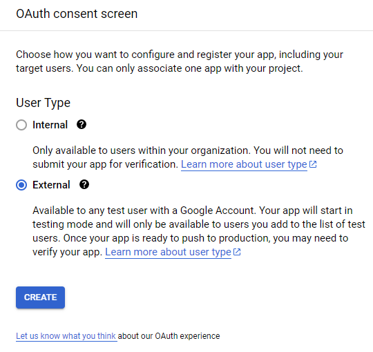

# Grade Assistant Proof of Concept
Use AI to grade open-response questions on a Google Forms Quiz or Application. Upload Google Form responses, projected grades, and resulting grade book to Google Sheets.

###### Please note this readme's [Possible Considerations for Enterprise Use section](#Chapter-3:-Possible-Considerations-for-Enterprise-Use) before implementing this codebase for enterprise use. With that in mind, this is a Proof of Concept: we have taken shortcuts you may wish to fix before using this codebase directly for enterprise use. Here is the [Link to the Possible Considerations for Enterprise Use seciton](#Possible-Considerations-for-Enterprise-Use).

<br>

## Table of Contents

- [Repo Summary](#Repo-Summary)
   - [Objectives](#Objectives)
   - [Keywords](#Keywords)
   - [Additional Value](#Additional-Value)
- [Usage](#Usage)
   - [Run the Code](#Run-the-Code)
   - [Setting Up Your Environment](#Setting-Up-Your-Environment)
   - [Update Your Credentials](#Update-Your-Credentials)
      - [Startup Endpoints](#Startup-Endpoints)
      - [Getting an OAuth Token](#Getting-an-OAuth-Token)
      - [Passing Google's OAuth Consent Screen](#OAuth-consent-screen)
         - [Edit app registration](#Edit-app-registration---OAuth-consent-screen)
         - [Scopes](#Edit-app-registration---Scopes)
         - [Test users](Edit-app-registration---Test-users)
         - [Summary](#Edit-app-registration---Summary)
   - [Common Errors](#Common-Errors)
- [Expected Output](#Expected-Output)
   - [Expected Local Output Files](#Expected-Local-Output-Files)
   - [Expected Google Output Files](#Expected-Google-Output-Files)
   - [What Do The Columns Mean?](#What-Do-The-Columns-Mean)
- [Possible Considerations for Enterprise Use](#Possible-Considerations-for-Enterprise-Use)
   - [Security](#Security)
   - [Better AI training](#Better-AI-training)
   - [Improving API call speed (Multithreading)](#Improving-API-call-speed-Multithreading)

<br>

_____________________________________________________

<br>

<br>

<br>

<br>

<br>

# Repo Summary

This is a Proof of Concept (PoC) for automating the grading of open-response answers using Google Forms and Google Sheets. The goal is to demonstrate the feasibility of using AI to grade questions and upload the results to Google Sheets.

<br>

## Objectives

1. Automate grading of open-response answers using AI.
2. Integrate with Google Forms to fetch submissions.
3. Upload grades to Google Sheets.

###### [back to top](#Grade-Assistant-Proof-of-Concept)

<br>

<br>

## Keywords

- Automating grading
- Open-response answers
- Google Forms
- Google Sheets
- Google OAuth 2.0 tokens
- OAuth consent screen
- API call speed optimization (multithreading)
- AI training
- Security considerations for enterprise use

###### [back to top](#Grade-Assistant-Proof-of-Concept)

<br>

<br>

## Additional Value

This readme provides step-by-step instructions on:
- Setting up Google OAuth 2.0 tokens
- Passing the OAuth consent screen process
- Configuring API credentials for desktop applications
- Integrating with Google Forms and Google Sheets

This repo can be a valuable resource for those looking to automate grading processes, integrate with Google Forms and Sheets, or learn about setting up OAuth tokens and API credential configuration.

###### [back to top](#Grade-Assistant-Proof-of-Concept)

<br>

_____________________________________________________

<br>

<br>

<br>

<br>

<br>

# Usage

<br>

## Run the Code

1. Update your credentials to use this code. (step-by-step walkthrough found [here](#Update-Your-Credentials))
   1. Make sure your Google Spreadsheet has a `Rubric` section. ([Here is a sample Google Spreadsheet](https://docs.google.com/spreadsheets/d/1esS07j_bAnAuJTlzbBSTuUt2BVFOLlRvsmu4IFkPL7U/edit?usp=sharing) you can copy)
   2. Make sure your Google Form has the following questions (`Name`, `Email`, `Phone number`) as questions with identical text as the ones in your rubric so that they can match up when auto-grading. ([Here is a sample Google Form](https://docs.google.com/forms/d/1srvrl8utwEa7ymMNUWZDBrK02AzbhUJrx3kgoJRZYzM/edit?usp=sharing) you can copy)
2. Set up your environment. (step-by-step walkthrough found [here](#Setting-Up-Your-Environment))
3. Run `python3 main.py` in a python-equipped terminal.

###### [back to top](#Grade-Assistant-Proof-of-Concept)

<br>

_____________________________________________________

<br>

<br>

<br>

<br>

<br>

## Setting Up Your Environment

### Default method

To use the `Auto Package Manager` system, simply run the code disregarding packages. The `Package Manager` system should automatically detect missing packages and install them automatically.

<br>

### Dealing with `Auto Package Manager` issues?

Try installing packages manually. In a Linux shell/terminal with python3 installed, run the following code:

1. `pip install google-api-python-client==1.7.9`
2. `pip install google-auth-httplib2==0.0.3`
3. `pip install google-auth-oauthlib==0.4.0`
4. `pip install apiclient==1.0.4`
5. `pip install getpass`
6. `pip install replicate`
7. `pip install pycryptodome cryptography`
8. `pip install --upgrade cryptography`

<br>

If issues with packages persist you may want to remove all packages (by running the code below) and re-install them manually (as shown above in [Dealing with `Auto Package Manager` issues?](#Dealing-with-Auto-Package-Manager-issues)).

`pip uninstall google-api-python-client google-auth-httplib2 google-auth-oauthlib apiclient pycryptodome cryptography`

###### [back to "Run the Code"](#Run-the-Code)

###### [back to top](#Grade-Assistant-Proof-of-Concept)

<br>

_____________________________________________________

<br>

<br>

<br>

<br>

<br>

## Common Errors

### Unknown Module
1. If the unknown module is 'replicate'
   1. Try running `pip install replicate` again
   2. Try running `pip install --upgrade --force-reinstall replicate` if the above does not work
2. If the unknown module is 'getpass'
   1. Try running `pip install getpass` again
   2. Try running `pip install --upgrade --force-reinstall getpass` if the above does not work

<br>

### 400 Error When Uploading Local CSV to Google Sheets
###### Error will look like this:
```cmd
<HttpError 400 when requesting https://sheets.googleapis.com/v4/spreadsheets/$Sheet_ID:batchUpdate?alt=json returned "Invalid requests[0].updateCells: Attempting to write column: 26, beyond the last requested column of: 25". Details: "Invalid requests[0].updateCells: Attempting to write column: 26, beyond the last requested column of: 25">
```
This is caused by the default maximum column limit imposed by Google Sheets on your Google Spreadsheet. Make sure your CSV doesn't have unintended commas. If this error persists, you may want to add columns manually.

###### [back to top](#Grade-Assistant-Proof-of-Concept)

<br>

_____________________________________________________

<br>

<br>

<br>

<br>

<br>

## Update Your Credentials

1. Download the `credentials.json` file
2. Update the `client-ID` and `client-secret` with your own, given to you by Google when you register an OAuth 2.0 client with Google via Google API Dashboard's [credential manager](https://console.cloud.google.com/apis/credentials). Go to the [Startup Endpoints section](#Startup-Endpoints) of this readme for a walkthrough on setting up your Google Project credentials.
3. Update the AI token
   1. Go to [replicate's website](https://replicate.com/docs/get-started/python#authenticate) to create a free account (by linking your GitHub account). NOTE: you get ten free API calls to the AI. You can add a payment method. Using the default settings will charge you approximately $0.000021 per API call. Feel free to set a monthly "Spend Limit" on [their billing page](https://replicate.com/account/billing). Supported models and pricing can be found on [their pricing page in the language models section](https://replicate.com/pricing#language-models)
      1. Model Options:
         1. meta/llama-2-13b
         2. meta/llama-2-13b-chat
         3. meta/llama-2-70b
         4. *meta/llama-2-70b-chat* (**default**)
         5. meta/llama-2-7b
         6. meta/llama-2-7b-chat
         7. meta/meta-llama-3-70b
         8. meta/meta-llama-3-70b-instruct
         9. meta/meta-llama-3-8b
         10. meta/meta-llama-3-8b-instruct
         11. mistralai/mistral-7b-instruct-v0.2
         12. mistralai/mistral-7b-v0.1
         13. mistralai/mixtral-8x7b-instruct-v0.1
      2. The model option is set in the `auto_grader_ai.py` file in the `ai` class, in the `generate_response` static method as the first parameter of the `replicate.stream()` function. You can change it to any other model if you'd like.
   2. Once you have an API token from [replicate's token section on their website](https://replicate.com/account/api-tokens): copy the token and run the following in a Python-enabled terminal.
      1. `python3 update.py`
      2. `update_token`
      3. `my_API_token` (make sure to replace `my_API_token` with the token from [replicate's token section on their website](https://replicate.com/account/api-tokens).
4. Update the Google Form ID
   1. Run the update script using the following code in a Python-enabled terminal. 
      1. `python3 update.py [OPTIONAL: Google_Form_URL]` (make sure to replace `[OPTIONAL: Google_Form_URL]` with the URL of your Google form **AND** *skip the 3rd step if you choose to do this*)
      2. `update_form`
      3. `Google_Form_URL` (make sure to replace `Google_Form_URL` with the URL of your Google form **ONLY IF** *you did not add the optional URL in the first step*)
         1. NOTE: you will not see an update as this will be read in as a password and will therefore be invisible.
6. Update the Google Sheets ID
   1. Run the update script using the following code in a Python-enabled terminal. 
      1. `python3 update.py [OPTIONAL: Google_Sheet_URL]` (make sure to replace `[OPTIONAL: Google_Sheet_URL]` with the URL of your Google sheet **AND** *skip the 3rd step if you choose to do this*)
      2. `update_spreadsheet`
      3. `Google_Sheet_URL` (make sure to replace `Google_Sheet_URL` with the URL of your Google sheet **ONLY IF** *you did not add the optional URL in the first step*)
         1. NOTE: you will not see an update as this will be read in as a password and will therefore be invisible.

###### [back to "Run the Code"](#Run-the-Code)

###### [back to top](#Grade-Assistant-Proof-of-Concept)

<br>

_________________________

<br>

<br>

<br>

<br>

<br>

## Startup Endpoints

To learn about setting up your endpoints for Google Sheets and Google Forms, look at their "Python quickstart guides." ([Python quickstart | Google Sheets link](https://developers.google.com/sheets/api/quickstart/python), [Python quickstart | Google Forms link](https://developers.google.com/forms/api/quickstart/python))

The short version is a 3-step process for both. 
1. Enable the API - must be completed separately for Google Sheets and Google Forms
   1. [Enable Google Sheets Endpoint link](https://console.cloud.google.com/flows/enableapi?apiid=sheets.googleapis.com)
   2. [Enable Google Forms Endpoint link](https://console.cloud.google.com/flows/enableapi?apiid=forms.googleapis.com)
2. Configure the OAuth consent screen (step-by-step guide in the [OAuth consent screen section](#OAuth-consent-screen))
3. Authorize credentials for a desktop application (step-by-step guide in the [Getting an OAuth Token section](#Getting-an-OAuth-Token))

###### [back to top](#Grade-Assistant-Proof-of-Concept)

<br>

_________________________

<br>

<br>

<br>

<br>

<br>

## Getting an OAuth Token

Go to [Google Cloud Consol's](https://console.cloud.google.com/) website and select the `APIs & Services` button.

Navigate to the `credentials` tab and select the `+ CREATE CREDENTIALS` button to reveal a drop-down of 4 items. 

Select the second item (`OAuth client ID`, sub-text: "Requests user consent so your app can access the user's data")

This will bring you to the "Create OAuth client ID" page.

Finally, click the application type dropdown, select `Desktop app`, and name it whatever you'd like.

Click the blue `CREATE` button at the bottom of the page.

A pop-up window will appear with your `client-ID` and `client-secret`. Save both somewhere secure.

###### [back to top](#Grade-Assistant-Proof-of-Concept)

<br>

_________________________

<br>

<br>

<br>

<br>

<br>

## OAuth consent screen

<a href="https://console.cloud.google.com/apis/credentials/consent" target="_blank" rel="noopener noreferrer">Navigate to Google's OAuth Consent Screen's website</a>

**Make sure the correct Google Project is selected in the top left!**

Click on External and hit the blue `CREATE` button.



<br>

<br>

## Edit app registration - OAuth consent screen

Enter a name in the "App Name" text-entry box and enter your email in the "User Support Email" text-entry box.

Scroll down to the "Developer contact information" section. 
Enter your email again into the "Email Address" text-entry box with the subtext: "*These email addresses are for Google to notify you about any changes to your project.*"

**Leave everything else blank.**

✔️ Select the `Save and Continue` button at the bottom of the page, **leaving everything else blank**.

<br>

<br>

## Edit app registration - Scopes

Select the `ADD OR REMOVE SCOPES` button to open a scopes table. The following table can be found on page 3. (results 22-27)

|add scope| API             | Scope                             | User-facing description                                                                  |
|---------|-----------------|-----------------------------------|------------------------------------------------------------------------------------------|
|☐|Google Forms API        | .../auth/drive                    | See, edit, create, and delete all of your Google Drive files                             |
|☐|Google Forms API        | .../auth/drive.file               | See, edit, create, and delete only the specific Google Drive files you use with this app |
|☐|Google Forms API        | .../auth/forms.body               | See, edit, create, and delete all your Google Forms forms                                |
|☐|Google Forms API        | .../auth/drive.readonly           | See and download all your Google Drive files                                             |
|☑️| Google Forms API      | .../auth/forms.body.readonly      | See all your Google Forms forms                                                          |
|☑️| Google Forms API      | .../auth/forms.responses.readonly | See all responses to your Google Forms forms                                             |
|☑️| Google Sheets API     | .../auth/spreadsheets             | See, edit, create, and delete all your Google Sheets spreadsheets                        |
|☑️| Google Sheets API     | .../auth/spreadsheets.readonly    | See all your Google Sheets spreadsheets                                                  |
|☐| Service Management API | .../auth/service.management       | Manage your Google API service configuration                                             |

Select the four rows above (28: `forms.body.readonly`, 29: `forms.responses.readonly`, 30: `spreadsheets`, and 31: `service.management`)

Scroll down and select the blue `UPDATE` button at the bottom to close the table and return to the previous page (Edit app registration - Scopes)

Note: *if these rows are missing, you may need to enable these endpoints for your Google Project. Learn more in the [Startup Endpoints Section](#Startup-Endpoints)*

✔️ Select the `SAVE AND CONTINUE` button at the bottom of the page.

<br>

<br>

## Edit app registration - Test users

Click the `+ ADD USERS` button. 

Add the Gmail account that owns the Google Form OR has viewing access to the Google Form's results.

✔️ Scroll to the bottom and select the `SAVE AND CONTINUE` button.

<br>

<br>

## Edit app registration - Summary

Here is a summary of the previous selections. 

✔️ Select the `BACK TO DASHBOARD` button to return to your dashboard and create an OAuth token. You can read more about creating an OAuth token in the [Getting an OAuth Token](#Getting-an-OAuth-Token) section of the README.

<br>

<br>

👏 Congradulations 🎉🎊

You have completed the OAuth Consent Screen and **PASSED**!

###### [back to top](#Grade-Assistant-Proof-of-Concept)

<br>

<br>

_____________________________________________________

<br>

<br>

<br>

<br>

<br>

# Expected Output

<br>

## Expected Local Output Files

### Default Locations
###### NOTE: These default locations can be changed in the `presets.py` file or by running `python3 update.py --show-all`

1. `submissions.csv` is a file representing submissions downloaded from your Google Form. If the data does not look correct, try updating your Google Form ID (`python3 update.py`). This file will be uploaded to your Google Spreadsheet in the `Submissions` tab/sheet.
    1. By default, it's located in your `output` folder (`./output/submissions.csv`).
    2. To change, go to `Presets.SUBMISSIONS_LOCATION` (type: `string`)
    3. To change, you can alternatively run `python3 update.py --show-all`
2. `graded_submissions.csv` is a file representing questions that have been graded (ordered by `applicant name`). This file will be uploaded to your Google Spreadsheet in the `AI Grades` tab/sheet.
    1. By default, it's located in your `output` folder (`./output/graded_submissions.csv`).
    2. To change, go to `Presets.GRADED_SUBMISSIONS_LOCATION` (type: `string`)
    3. To change, you can alternatively run `python3 update.py --show-all`
3. `gradebook_report.csv` is a file representing the average grades applicants received on questions that have been graded (ordered by `applicant name`). This file will be uploaded to your Google Spreadsheet in the `Student Gradebook` tab/sheet.
    1. By default, it's located in your `output` folder (`./output/gradebook_report.csv`).
    2. To change, go to `Presets.GRADEBOOK_REPORT_LOCATION` (type: `string`)
    3. To change, you can alternatively run `python3 update.py --show-all`
4. `rubric.csv` is a file representing the rubric AI uses to grade questions. This file can be found in your Google Spreadsheet in the `Rubruc` tab/sheet. If the file does not exist locally before you run the program, it will automatically download the file from the Google Spreadsheet. If the tab/sheet in your Google Spreadsheet titled `"Rubruc"` does not exist it may cause an issue for the program.
    1. By default, it's located in your current folder (`./rubric.csv`).
    2. To change, go to `Presets.RUBRIC_LOCATION` (type: `string`)
    3. To change, you can alternatively run `python3 update.py --show-all`

###### [back to top](#Grade-Assistant-Proof-of-Concept)

<br>

_____________________________________________________

<br>

<br>

<br>

<br>

<br>

## Expected Google Output Files

The Google Spreadsheet is based on the `Presets.GOOGLE_SPREADSHEET_ID` value. The authenticating user **must** have "edit permissions." To update or change the value simply run `python3 update.py`, select "update_sheet", and enter the Google Spreadsheet URL.

Below are the three new tabs that the script will upload during runtime.

1. `Responses` contains the responses collected from the Google Form. This is an exact copy of the local `submissions.csv` file with correct formatting (commas where they should be).
2. `AI Grades` contains the grades collected from grading the responses of the Google Form. This is an exact copy of the local `graded_submissions.csv` file with correct formatting (commas where they should be).
3. `Student Gradebook` contains applicant grade averages and other metrics. This is an exact copy of the local `gradebook_report.csv` file with correct formatting (commas where they should be).

###### [back to top](#Grade-Assistant-Proof-of-Concept)

<br>

_____________________________________________________

<br>

<br>

<br>

<br>

<br>

## What Do The Columns Mean?

### Responses tab/sheet
1. `responseId`
   1. Created by Google to enable multiple responses by the same user. This is turned off by default but each response has an ID anyway.
2. `createTime`
   1. The time at which the user started their response.
3. `lastSubmittedTime`
   1. The most recent submission time (if multiple edits are allowed).
4. rest
   1. Every following column header is a question from the Google Form in order. (Name, email, phone number, question1, question2, ...)

### AI Grades tab/sheet
1. `Name`
   1. The name of the user.
   2. To change this column (if the Google Form uses "Full Name", or a different case, etc) change the value directly in `Presets.GOOGLE_FORM_USER_IDENTIFIER`.
2. `Question`
   1. The question the applicant is answering for which the rubric was found.
3. `Response`
   1. The user's response to that question.
4. `AI Grade`
   1. A score from 0-9 (min=0, max=9). 
5. `AI Reasoning`
   1. The reasoning as to why the AI chose this score.

### Student Gradebook tab/sheet
1. `Name`
   1. The name of the user. To change this column (if the Google Form uses "Full Name", or a different case, etc: change the value directly in `Presets.GOOGLE_FORM_USER_IDENTIFIER`).
2. `email`
   1. The email the user gave in the Google Form.
3. `phone number`
   1. The phone number the user gave in the Google Form.
4. `AI Letter Grade`
   1. A letter grade derived from the percentage as follows:
      1. `A` `≥` `0.9` (`90%`)
      2. `B` `≥` `0.8` (`80%`)
      3. `C` `≥` `0.7` (`70%`)
      4. `D` `≥` `0.6` (`60%`)
      5. `F` `<` `0.6` (`59%`)
5. `AI Percentage`
   1. A percentage scored by averaging the applicant's grades. We recommend formatting this column as `number > percentage` in Google Sheets.
6. `Avg AI Score`
   1. Average score the AI gave to each response for this user. (min=0, max=9)
7. `Volatility`
   1. The consistency of the AI's grades for this user. `0.0` means the AI gave all the same scores while `1.0` means the AI gave an equal number of highest possible scores to the lowest possible scores.
   2. `[0, 0, 0, 0]` &nbsp;&nbsp;&nbsp; `->` &nbsp;&nbsp;&nbsp; `Volatility` `=` `0.0`
   3. `[9, 9, 9, 9]` &nbsp;&nbsp;&nbsp; `->` &nbsp;&nbsp;&nbsp; `Volatility` `=` `0.0`
   4. `[0, 9, 0, 9]` &nbsp;&nbsp;&nbsp; `->` &nbsp;&nbsp;&nbsp; `Volatility` `=` `1.0`
8. `Classification`
   1. Volatility score classified:
      1. `Volatility` `<` `0.15` &nbsp;&nbsp;&nbsp; `->` &nbsp;&nbsp;&nbsp; `Classification:` `Very Consistent`
      2. `Volatility` `<` `0.32` &nbsp;&nbsp;&nbsp; `->` &nbsp;&nbsp;&nbsp; `Classification:` `Consistent`
      3. `Volatility` `<` `0.55` &nbsp;&nbsp;&nbsp; `->` &nbsp;&nbsp;&nbsp; `Classification:` `Somewhat Inconsistent`
      4. `Volatility` `<` `0.70` &nbsp;&nbsp;&nbsp; `->` &nbsp;&nbsp;&nbsp; `Classification:` `Very Inconsistent`
      4. `Volatility` `>` `0.70` &nbsp;&nbsp;&nbsp; `->` &nbsp;&nbsp;&nbsp; `Classification:` `HIGHLY VOLATILE`
9. `Scores`
   1. A list of all scores scored by the AI.

###### [back to top](#Grade-Assistant-Proof-of-Concept)

<br>

_____________________________________________________

<br>

<br>

<br>

<br>

<br>

#  Possible Considerations for Enterprise Use

1. ### Security
   1. ###### Please Note: We do not believe this to be a consideration if you run this code on a local machine in your physical possession. 
   2. We save your `Replicate` token locally in the `token.vault` file using a robust encryption scheme (see `secureparsing.py` for more info). Every time the token is read, it is re-encrypted based on the time. The time is never saved. If this security scheme breaks your corporation's "secure storage standards" (SSS), you may want to consider other solutions. 
      1. A possible solution may be writing it to your operating system's environment variables instead of a local file. This may obfuscate the retrieval process and make it challenging to leak the token accidentally.
      2. Alternatively, if you run this code on a cloud provider's automation account (AWS, Google Cloud, Microsoft Azure, etc), you may want to look into their secret storage manager (SSM). They do this for you.
   3. We save your Google `Client ID` and `Client Secret` in an unencrypted json file (`credentials.json`). Depending on your corporation's "secure storage standards" (SSS), you may wish to change this.
   4. The Google OAuth 2.0 token is saved locally in `json` form during runtime. It is **never** deleted after code execution. In theory, an attacker could leverage this old token to generate a new one, but it is unlikely and reduces the general load if saved like we have it set up to be. The most viable mitigation tactic would be to remove the file after runtime if you do not project the use of this code for longer than an hour.
2. ### Better AI training
   1. Regarding enhancing AI scores, we recommend editing the `background.txt` file (lines 10 and 12). The following changes will impact the AI's scoring performance for all questions. To alter the AI's scoring of specific questions, alter the rubric for those specific questions.  **Make sure to update the local `rubric.csv` file if you add it to the one on Google Spreadsheets or delete it locally, and the script will automatically download the rubric from Google Spreadsheets.**
      1. Removing instructions like "take into account the flow of the applicant's response and grammar/spelling" will make the AI less stringent with spelling and grammar mistakes. 
      2. Adding text like "Applicants must provide examples from their life experience" will make the AI take points off for missing anecdotes.
   2. We send all data (background, rubric, question, submission) in one message. This can open the system to malicious, prompt engineering attacks, and may reduce the quality of AI responses. A potential mitigation/improvement is training the AI with the background, sending the rubric and question in separate messages, and sending the submission in a final message for grading.
3. ### Improving API call speed (Multithreading)
   1. While grading each question, our code calls the Replicate API. When calling the API, our code waits for a response before grading the next question. On average, Replicate takes 3 - 5 seconds to reply. Depending on the multithreading scheme, running multiple threads or processes may decrease runtime by 80%—95%.
   2. A more straightforward solution may be to run the code at night or over weekends.

###### [back to top](#Grade-Assistant-Proof-of-Concept)

<br>

<br>

<br>

<br>

<br>

<br>
